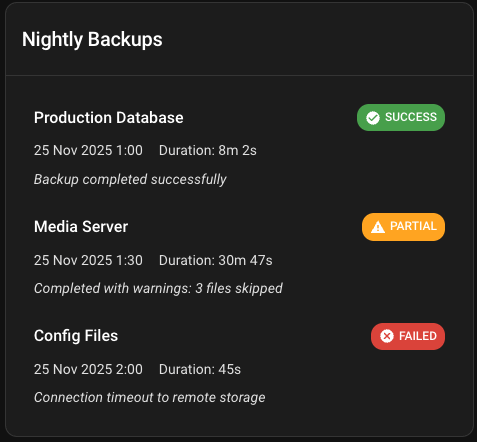

# Home Assistant Backup Card

A custom Lovelace card for Home Assistant that displays automated backup results with status indicators, timestamps, durations, and notes.

## Preview

Here's what the card looks like:



## Features

- Display single or multiple backup entries in compact table format
- Click any row to open detailed modal view
- Color-coded status badges (success, partial, failed)
- Consistent date formatting ("12 Nov" format)
- Human-readable duration display
- Optional backup size display
- Theme-aware styling (light/dark mode)
- Mobile responsive design
- Auto-refresh when entity updates
- Optional error display for debugging

## Installation

### 1. Build the Card

```bash
npm install
npm run build
```

This creates `dist/backup-card.js`.

### 2. Copy to Home Assistant

Copy the built file to your Home Assistant `www` directory:

```bash
cp dist/backup-card.js /path/to/homeassistant/www/backup-card/
```

### 3. Register as Resource

Add the card as a resource in Home Assistant. Either via UI or in `configuration.yaml`:

**Via UI:**
1. Go to Settings → Dashboards → Resources
2. Click "Add Resource"
3. URL: `/local/backup-card/backup-card.js`
4. Resource type: JavaScript Module

**Via YAML:**
```yaml
lovelace:
  resources:
    - url: /local/backup-card/backup-card.js
      type: module
```

### 4. Restart Home Assistant

Restart Home Assistant to load the new resource.

## Configuration

### Basic Card Configuration (Single Entity)

```yaml
type: custom:backup-card
entity: sensor.backup_results
```

### Multiple Entities Configuration

The card can display backups from multiple entities, with each entity representing one backup:

```yaml
type: custom:backup-card
entities:
  - sensor.backup_pihole
  - sensor.backup_database
  - sensor.backup_home_assistant
title: "System Backups"
```

### Full Configuration

```yaml
type: custom:backup-card
entities:
  - sensor.backup_pihole
  - sensor.backup_database
  - sensor.backup_home_assistant
title: "Nightly Backups"
show_header: true
show_errors: false
```

### Configuration Options

| Option | Type | Default | Description |
|--------|------|---------|-------------|
| `entity` | string | **Required*** | Entity ID of a single backup sensor |
| `entities` | array | **Required*** | Array of entity IDs (one backup per entity) |
| `title` | string | `"Backup Status"` | Card title |
| `show_header` | boolean | `true` | Show/hide card header |
| `show_errors` | boolean | `false` | Display validation errors in UI (otherwise console only) |

**Note:** You must specify either `entity` or `entities`, but not both.

## Card Interactions

### Normal View

The card displays backups in a compact table format with three columns:
- **Name**: Server/application name
- **Date**: Short date format (e.g., "25 Nov")
- **Status**: Color-coded status badge

Click any row to open the detailed modal view.

### Detailed Modal

Clicking any backup row opens a centered modal dialog showing **ALL** backups with complete information:
- **Name**: Server/application name
- **Date/Time**: Full timestamp (e.g., "25 Nov 01:00")
- **Size**: Backup size if provided (shows "-" if not available)
- **Duration**: Time taken to complete
- **Status**: Color-coded status badge
- **Notes**: Displayed as indented text below each row

Close the modal by:
- Clicking the X button in the top-right corner
- Clicking outside the modal (on the backdrop)

## Entity Data Format

The card supports two entity attribute formats:

### Format 1: Multiple Backups (Array)

```yaml
sensor.backup_results:
  state: "OK"
  attributes:
    backups:
      - name: "Production Database"
        start: "2025-11-25T01:00:00+11:00"
        duration: 482
        outcome: "success"
        notes: "Backup completed successfully"
      - name: "Media Server"
        start: "2025-11-25T01:30:00+11:00"
        duration: 1847
        outcome: "partial"
        notes: "Completed with warnings"
```

### Format 2: Single Backup (Flat Attributes)

```yaml
sensor.backup_results:
  state: "success"
  attributes:
    name: "Production Database"
    start: "2025-11-25T01:00:00+11:00"
    duration: 482
    outcome: "success"
    notes: "Backup completed successfully"
```

### Backup Entry Fields

| Field | Type | Required | Description |
|-------|------|----------|-------------|
| `name` | string | Yes | Server/application name |
| `start` | string | Yes | ISO 8601 timestamp |
| `duration` | number | Yes | Duration in seconds |
| `outcome` | string | Yes | `success`, `failed`, or `partial` |
| `notes` | string | No | Additional information or error messages |
| `size` | string | No | Backup size (e.g., "2.4 GB", "450 MB") |

## Setting Up MQTT Sensors (Recommended)

### Option 1: Single Entity with Multiple Backups

```yaml
mqtt:
  sensor:
    - name: "Backup Results"
      unique_id: backup_results
      state_topic: "homeassistant/sensor/backups/state"
      value_template: "{{ value_json.backups | length }} backups"
      json_attributes_topic: "homeassistant/sensor/backups/state"
```

### Option 2: Multiple Entities (One per Backup)

This approach uses one MQTT sensor per backup, which better retains state after Home Assistant reboots:

```yaml
mqtt:
  sensor:
    - name: "Pi-hole Backup"
      unique_id: backup_pihole
      state_topic: "homeassistant/sensor/backup/pihole"
      value_template: "{{ value_json.outcome }}"
      json_attributes_topic: "homeassistant/sensor/backup/pihole"

    - name: "Database Backup"
      unique_id: backup_database
      state_topic: "homeassistant/sensor/backup/database"
      value_template: "{{ value_json.outcome }}"
      json_attributes_topic: "homeassistant/sensor/backup/database"

    - name: "Home Assistant Backup"
      unique_id: backup_home_assistant
      state_topic: "homeassistant/sensor/backup/home_assistant"
      value_template: "{{ value_json.outcome }}"
      json_attributes_topic: "homeassistant/sensor/backup/home_assistant"
```

**Important:** Use `retain: true` when publishing MQTT messages to ensure values persist after Home Assistant reboots.

### Backup Script Example - Single Entity (Python)

```python
import paho.mqtt.publish as publish
import json
from datetime import datetime

result = {
    "backups": [
        {
            "name": "Production DB",
            "start": datetime.now().isoformat(),
            "duration": 482,
            "outcome": "success",
            "notes": "Completed successfully",
            "size": "2.4 GB"
        }
    ]
}

publish.single(
    "homeassistant/sensor/backups/state",
    json.dumps(result),
    hostname="mqtt-broker",
    retain=True
)
```

### Backup Script Example - Multiple Entities (Python)

```python
import paho.mqtt.publish as publish
import json
from datetime import datetime
import time

start_time = datetime.now()
start_seconds = time.time()

# Run your backup command
try:
    # Your backup logic here
    outcome = "success"
    notes = "Backup completed successfully"
except Exception as e:
    outcome = "failed"
    notes = f"Backup failed: {str(e)}"

duration = int(time.time() - start_seconds)

# Publish to dedicated topic
result = {
    "name": "Pi-hole",
    "start": start_time.isoformat(),
    "duration": duration,
    "outcome": outcome,
    "notes": notes,
    "size": "450 MB"  # Optional: include backup size
}

publish.single(
    "homeassistant/sensor/backup/pihole",
    json.dumps(result),
    hostname="mqtt-broker",
    retain=True  # Important for persistence!
)
```

### Backup Script Example - Multiple Entities (Bash)

```bash
#!/bin/bash

BACKUP_NAME="Pi-hole"
MQTT_TOPIC="homeassistant/sensor/backup/pihole"

START_TIME=$(date -u +"%Y-%m-%dT%H:%M:%S%z")
START_SECONDS=$(date +%s)

# Run your backup command
if backup_command; then
    OUTCOME="success"
    NOTES="Backup completed successfully"
else
    OUTCOME="failed"
    NOTES="Backup failed with exit code $?"
fi

END_SECONDS=$(date +%s)
DURATION=$((END_SECONDS - START_SECONDS))

# Publish to MQTT with retain flag (-r)
mosquitto_pub -h mqtt-broker -t "$MQTT_TOPIC" -r -m "{
    \"name\": \"$BACKUP_NAME\",
    \"start\": \"$START_TIME\",
    \"duration\": $DURATION,
    \"outcome\": \"$OUTCOME\",
    \"notes\": \"$NOTES\",
    \"size\": \"450 MB\"
}"
```

## Development

### Build Commands

```bash
npm run build     # Production build
npm run watch     # Watch mode
npm run dev       # Development mode with source maps
```

### Project Structure

```
backup-card/
├── src/
│   ├── backup-card.ts          # Main card component
│   ├── types.ts                # TypeScript interfaces
│   ├── styles.ts               # CSS styles
│   ├── config.ts               # Configuration validation
│   ├── components/
│   │   ├── backup-item.ts      # Backup entry component
│   │   └── outcome-badge.ts    # Status badge component
│   └── helpers/
│       ├── date.ts             # Date formatting
│       ├── duration.ts         # Duration formatting
│       └── status.ts           # Status utilities
├── dist/                       # Build output
├── public/                     # Demo data
└── rollup.config.js            # Build configuration
```

## Outcome Values

The `outcome` field supports the following values:

- `success`, `ok`, `completed` → Green success badge
- `partial`, `warning`, `warn` → Orange warning badge
- `failed`, `fail`, `error` → Red error badge

## Troubleshooting

### Card Not Appearing

1. Check browser console for errors
2. Verify resource is registered correctly
3. Clear browser cache (Ctrl+Shift+R or Cmd+Shift+R)
4. Ensure entity exists and has correct attributes

### Entity Not Found Error

- Verify the entity ID in your card configuration
- Check that the sensor is properly configured
- Ensure MQTT messages are being published (if using MQTT)

### Dates Not Formatting Correctly

- Ensure `start` field uses ISO 8601 format
- Include timezone information (e.g., `+11:00`)
- Card uses Home Assistant locale settings automatically

### Validation Errors

Set `show_errors: true` to display validation errors in the card UI for debugging.

## License

MIT

## Credits

Built with:
- [Lit](https://lit.dev/) - Web components framework
- [Home Assistant](https://www.home-assistant.io/) - Open source home automation
- [Rollup](https://rollupjs.org/) - Module bundler
